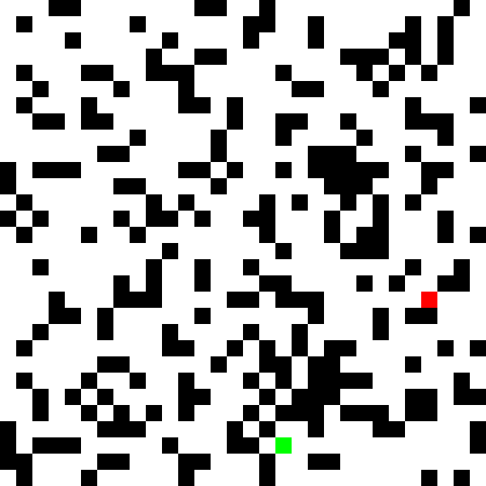

## 注意事項

- 程式碼聲明
  本作業的程式碼是參考 ChatGPT 和我的上學期的期末作業 [連結網址](https://github.com/al2698/al111a/blob/c6b76ceb80447882aafcbeee638fbbd5f22f03d3/HW/mid/WAKUWAKU%20%E5%B0%8B%E6%89%BE%E8%88%88%E5%A5%AE%E6%BA%90%20(%E2%8C%93%E2%80%BF%E2%8C%93).md)。

---
# 老鼠走迷宮

> 程式碼：[ipynb](./HW3.ipynb)

## 迷宮生成器

此迷宮生成器是一個簡單的Python程式，用於生成隨機的迷宮。

### 使用方式

執行程式後，迷宮的高度（h）和寬度（w）會被設定為30。起始點（S）會在迷宮內隨機選擇，並且迷宮中會隨機生成牆壁（W）以及終點（E）。

```py
h = 30  # 迷宮高度
w = 30  # 迷宮寬度
start_x = random.randint(0, h - 1)
start_y = random.randint(0, w - 1)

maze = generate_maze(h, w, start_x, start_y)
print(start_x, start_y)
for row in maze:
    print(' '.join(row))
```

### 注意事項
- 此程式碼僅供生成迷宮使用，並不包含迷宮求解的功能。
- 迷宮生成過程中，起始點（S）和終點（E）會被隨機生成，牆壁（W）的生成機率為0.3。
- 本程式碼可以根據需要進行修改和擴展。

## 迷宮解謎器
此程式是一個迷宮解謎器，使用深度優先搜索（DFS）算法在迷宮中尋找從起點（S）到終點（E）的最短路徑。

### 使用方式
首先，確保已經生成迷宮（可參考迷宮生成器程式碼）。接下來，使用以下程式碼調用 save_maze_solution 函式來生成解謎過程的GIF動畫並儲存。

```py
Test_maze = maze  # 輸入迷宮，此處使用的是測試迷宮 Test_maze
save_maze_solution(Test_maze, start_x, start_y, max_steps=1500)
```

函式參數解釋：

- maze: 迷宮矩陣
- start_x、start_y: 起點的座標
- max_steps: 最大步數限制（限制DFS搜索的步數）
- block_size: 圖像方塊的大小（像素）
- duration: GIF動畫的每幀持續時間（毫秒）
- loop: GIF動畫的循環次數（0表示無限循環）
生成的迷宮解謎過程GIF動畫將儲存為 maze_solution.gif。

### 注意事項
- 在使用此程式之前，請確保已經生成了迷宮。
- 迷宮解謎過程中，將使用DFS算法進行搜索，直到找到從起點到終點的最短路徑或達到最大步數限制。
- 解謎過程的每一幀圖像都將根據迷宮矩陣的內容進行顏色填充，形成動畫。

