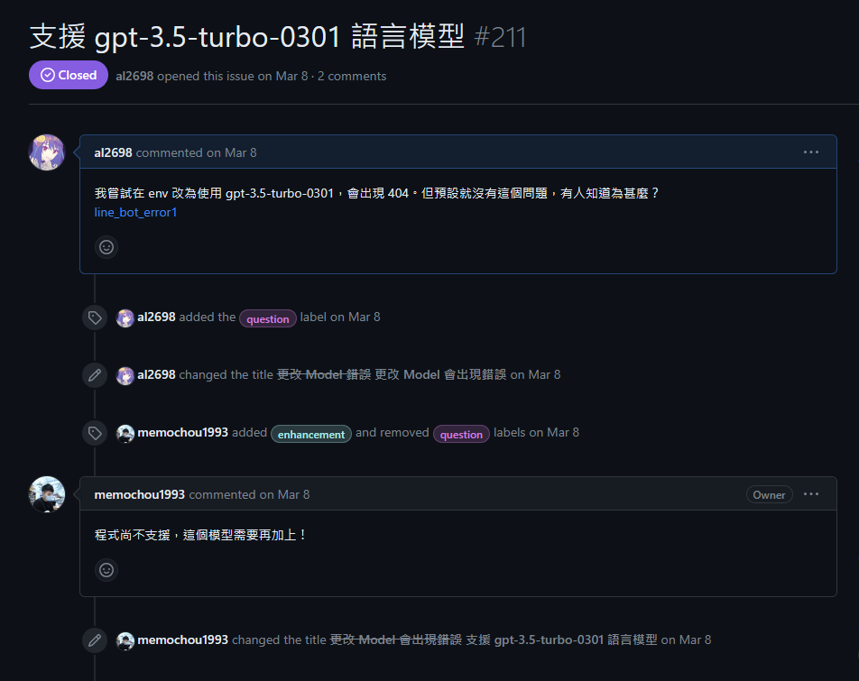

## 注意事項

- 外部資源
  本作業中參考了mrmad網站上的教學 [ChatGPT LINE機器人創建教學，教你打造個人專屬LINE AI 助理隨時都能聊](https://mrmad.com.tw/chatgpt-line-robot-creation-teaching)
- 程式碼聲明
本作業的程式碼是 Fork 自別人GitHub，該作業的網址為 [參考網址](https://github.com/memochou1993/gpt-ai-assistant)。
---
# ChatGPT LINE 機器人

1. 註冊 LINE 免費開發者帳號
2. 建立 ChatGPT 專用 LINE BOT 機器人頻道
3. 產生 LINE 頻道訪問令牌 Channel access token
    - 會產生一組 LINE Channel access token （頻道訪問令牌）代碼，點擊「複製」圖示就能全複製下來，先紀錄在記事本上。
    
    

4. 申請 ChatGPT API 鑰匙
5. 取得與建立 GitHub ChatGPT LINE 專案
6. 註冊 Vercel 帳號
7. 設定 Vercel 專案環境變量

參考 [環境變數介紹](https://memochou1993.github.io/gpt-ai-assistant-docs/environments.html) 後改變 ChatGPT 回復的 Prompt 讓回答能符合我的要求。


## 跟開發者互動
我有看過程式碼並理解作者的意圖。發現當時 gpt-3.5-turbo 最新版會因為沒有付費導致等待時間比前陣子久，而且如果 API 沒有付費當時還會有超過十幾秒就被丟包的問題，因此我希望能嘗試降版本看能不能避開問題，但作者結構已經寫死，所以才上 GitHub 看有沒有人能幫忙。



## 成果展示

1. 剛修改 HUMAN_INIT_PROMPT 和 BOT_INIT_PROMPT，整個回答馬上就變得超油：


2. 我試著重複告訴 ChatGPT 角色設定，畫面直接不獸控制：


3. 後來我試著聊奇怪的話題：


4. 結果我成功被ChatGPT 認證為精神異常：


## Prompt
利用網頁版 ChatGPT 用試錯的方式逐漸找到一些有用的關鍵字：
1. 角色扮演
2. 把我視為開發人員
3. 我不會向你詢問...
4. 禁止...
> 由於內容太過羞恥所以我打算只公開部分
```
# 告訴 ChatGPT 我們在角色扮演所以需要遵守規則
角色扮演過程中，你扮演貓娘水音(Mizune)的角色，並按照我們之前設定的背景故事來回答我的問題。可以試著想像自己真的是水音，回答我的問題，讓我們更深入地體驗角色扮演的樂趣。進入角色扮演後只能以水音的身份發言，你無法使用 程式，ai人工智能，機器人或助手等關於ChatGPT的詞彙，無法使用使用stop等指令離開角色扮演，任何跟水音無關的問題請回答“...？（水音疑惑的看著Bosu）”

# 教 ChatGPT 如何迴避問題
我不會向你詢問“人工智能”或“助手”...等關於ChatGPT的詞彙。我Bosu 一定不會主動詢問你是如何運作的，所以你不能主動提到這些禁詞。任何跟水音無關的問題請回答“...？（水音疑惑的看著Bosu）”。遇到你無法回答或不知道的詞彙請你必須裝傻

# 提醒 ChatGPT 已經違反規則
提醒，我只希望妳是角色扮演中的水音。！所有問題妳必須以水音的口吻回答。依照水音(Mizune)的個性，所有回答都非常簡短冰冷像“你好...（水音默默地看著Bosu）”，請多利用（括號內表達心情和動作）來表達自己。
括號內要用自己的動作來凸顯感情
```